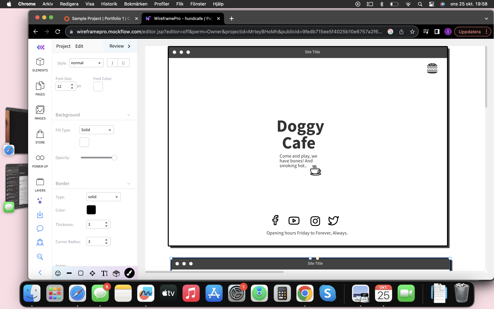
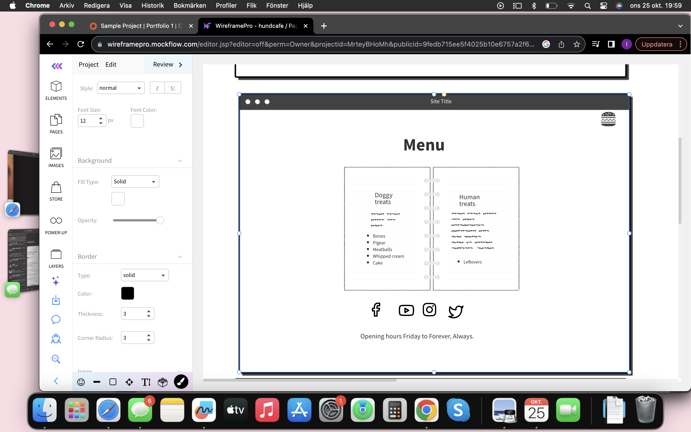
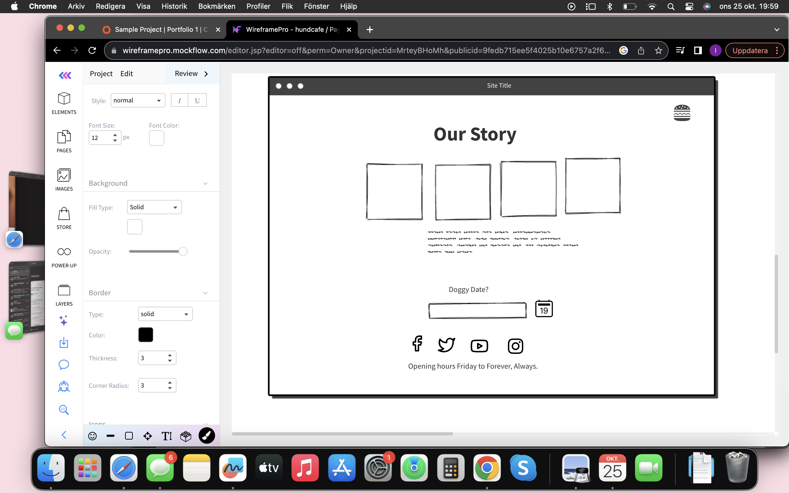

<h1>Doggy Cafe</h1>
 
 
<h3>Wireframe</h3>

 
<h4>Day one</h4>
Open a repository on github and open workspace on gitpod. 
Create files: index.html, menu.html and about.html.
Create folders: assets, css and images. 
Add html-structure for index.html, menu.html and about.html. 
Add metalinks for search-engines.
Add paragraphs, headings and list. Write text for these. 
Add a few ids.
Read code from loverunning and thrive.
Add social media links and find appropiate icons for these on frontawesome.
Find appropriate pictures, on pexels and unsplash. Find icon for coffe on index page on fontawesome.
! Had a problem with not being able to open in browser. (SCREENSHOT: of errorpage) Triplechecked code and ran through w3c. Couldn't find the error so I asked for help from student care. I shared my workspace and .. showed me via a screenshot (add SCREENSHOT) that I was supposed to click on "the 8000 globe" !
 
<h4>Day two</h4>
Develop text in paragraph and lists.
Choose and pictures for backgrounds and for gallery. 
Go through code and look for errors. 
Add a few more ids.
Start styling in style.css. 
Add pictures for backgrounds on index.html and menu.html. Add pictures to gallery in about.html.
Try to remember when to use section and when to use div. Don't remember so I research when to use section and when to use div.
Find: https://www.geeksforgeeks.org/what-is-the-difference-between-section-and-div-tags-in-html/
Make changes in code from info above. 

Have three problems:
1. Pictures don't work.
2. Opening hours is not footer background color.
3. The text in homepage/index.html links to about.html

Solution?
1. Realize that I haven't saved changes. Click save on each file and git add, commit and push after each. Now the picture in menu works. Not the others.
2. Add id="footer" to the section in footer and copy-paste background color from id="social-media" to id="footer. Does not work. 
3. Add text-decoration: none; color: black to body. Does not work.

Try to push down footer with, flex: 0; on footer and flex: 1; on main. Does not work. 
So I rehearse and read --> https://css-tricks.com/snippets/css/a-guide-to-flexbox/