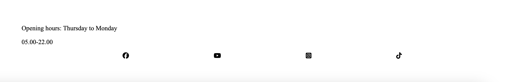

# [DOGGYCAFE](https://ilswh.github.io/doggycafe)

Doggy Cafe is a cafe for dog-families in beautiful surroundings.
The website consist of five pages; home, menu, about, gallery and contact. 

My hope is that this site let's more people know more about the Doggy Cafe and makes people curious.
The target audience is people with dogs, people who love dogs and people who want to enjoy the countryside of Uppsala, Sweden.
The site will be useful for this audience because they will discover a place peace and joy.

Consider adding a mockup image using the "Am I Responsive" website.
Here's your deployed site as an example:
https://ui.dev/amiresponsive?url=https://ilswh.github.io/doggycafe

## UX

My design process started with sketches with pen and paper and proceeded to making wireframes. 
After that I started creating the html structure. Lastly I started styling with css.

### Colour Scheme

I chose to keep it simple and stick with black and white. 
When it comes to the photos, I wanted colors that felt close to nature. 
For the background picture I wanted something earthy and grounded.
As for the gallery I wanted to expand and add the blues together with greens for some crisp. 
But still in the same place which is the caring embrace of nature.
Explain your colours and the colour scheme.

- Black used for text.
- White used for background.
- White used for header and footer

### Typography

I chose Times New Roman although it is not made for the web, it is my favourite as it gives me the feeling of having met before.
I used icons from Font Awesome.

- [Font Awesome](https://fontawesome.com) icons were used throughout the site, such as the social media icons in the footer.

## Wireframes

I've used ['Mockflows WireframePro'](https://www.mockflow.com/apps/wireframepro/) to design my site wireframes.

### Desktop Wireframes

Home
  - 

About
  - 

Menu
  - 

Gallery
  - 

## Features

As mentioned above, the Doggy Cafe website consist of five pages.
Home which is as introduction of the cafe.
Menu which introduces my customers to what we serve; dogs and humans.
About shows the background story of Doggy Cafe.
Gallery shows pictures taken of visitors of the Cafe and the surroundings.
Contact gives the curious or/and intrigued an opportunity to ask questions or send a request.

In this section, you should go over the different parts of your project,
and describe each in a sentence or so.

You will need to explain what value each of the features provides for the user,
focusing on who this website is for, what it is that they want to achieve,
and how your project is the best way to help them achieve these things.

For some/all of your features, you may choose to reference the specific project files that implement them.

IMPORTANT: Remember to always include a screenshot of each individual feature!

### Existing Features

- **Home**

    - Home is the introduction to Doggy Cafe and is there to underwhelm and create a desire to find out more and start exploring the site. 

- **Menu**

    - The menu shows what visitors can expect food-whys when they arrive. 
    For themselves and their dog.

- **About**

    - About lets the visitor know when and why the idea of the Doggy Cafe was born.

- **Gallery**

    - The gallery is an feel of an visual experience of the Doggy Cafe. It is the ambiance of Doggy Cafe.

- **Contact**

    - The form on contact is there to not leave any wondering or wandering minds lost or left behind.

- **Confirmationr**

    - After filling in a contact form and sending it, the website takes you to a confirmation page.

- **Social Media & Opening Hours**

    - In the footer is Social Media icons with links and the Doggy Cafes opening hours. So all guests know when to visit and dicover our marketing/media section.

- **Navigation Bar**

    - The navigation bar is there to make it simple for the customer.

### Future Features

- Menu book
    - As seen in the wireframe, I want to make it look like you open a book when looking at the menu.
- Adress
    - I want to add the adress in the footer.
- Hamburger bar
    - I want to add an hamburger bar where the nav-bar is in the header.
- Colors
    - I want to choose and add the approiate colors.
- Font
    - I want to find diffrent fonts for the headings and paragraphs and also another one for the h1.
- Icons
    - I want to add more icons and emojis here and there. Emoji-faces and leaves and waterfalls etc.

## Tools & Technologies Used

In this section, you should explain the various tools and technologies used to develop the project.
Make sure to put a link (where applicable) to the source, and explain what each was used for.
Some examples have been provided, but this is just a sample only, your project might've used others.
Feel free to delete any unused items below as necessary.

- [CSS Flexbox](https://www.w3schools.com/css/css3_flexbox.asp) used for an enhanced responsive layout.
- [CSS Grid](https://www.w3schools.com/css/css_grid.asp) used for an enhanced responsive layout..
- [Git](https://git-scm.com) used for version control. (`git add`, `git commit`, `git push`)
- [GitHub](https://github.com) used for secure online code storage.
- [GitHub Pages](https://pages.github.com) used for hosting the deployed front-end site.
- [Gitpod](https://gitpod.io) used as a cloud-based IDE for development.
- [Bootstrap](https://getbootstrap.com) used as the front-end CSS framework for modern responsiveness and pre-built components.
- [Materialize](https://materializecss.com) used as the front-end CSS framework for modern responsiveness and pre-built components.

## Testing

All testing can be found in the [TESTING.md](TESTING.md) file.

## Deployment

The site was deployed to GitHub Pages. The steps to deploy are as follows:

- In the [GitHub repository](https://github.com/ilswh/doggycafe), navigate to the Settings tab 
- From the source section drop-down menu, select the **Main** Branch, then click "Save".
- The page will be automatically refreshed with a detailed ribbon display to indicate the successful deployment.

The live link can be found [here](https://ilswh.github.io/doggycafe)

### Local Deployment

This project can be cloned or forked in order to make a local copy on your own system.

#### Cloning

You can clone the repository by following these steps:

1. Go to the [GitHub repository](https://github.com/ilswh/doggycafe) 
2. Locate the Code button above the list of files and click it 
3. Select if you prefer to clone using HTTPS, SSH, or GitHub CLI and click the copy button to copy the URL to your clipboard
4. Open Git Bash or Terminal
5. Change the current working directory to the one where you want the cloned directory
6. In your IDE Terminal, type the following command to clone my repository:
	- `git clone https://github.com/ilswh/doggycafe.git`
7. Press Enter to create your local clone.

Alternatively, if using Gitpod, you can click below to create your own workspace using this repository.

Please note that in order to directly open the project in Gitpod, you need to have the browser extension installed.
A tutorial on how to do that can be found [here](https://www.gitpod.io/docs/configure/user-settings/browser-extension).

#### Forking

By forking the GitHub Repository, we make a copy of the original repository on our GitHub account to view and/or make changes without affecting the original owner's repository.
You can fork this repository by using the following steps:

1. Log in to GitHub and locate the [GitHub Repository](https://github.com/ilswh/doggycafe)
2. At the top of the Repository (not top of page) just above the "Settings" Button on the menu, locate the "Fork" Button.
3. Once clicked, you should now have a copy of the original repository in your own GitHub account!

### Local VS Deployment

Use this space to discuss any differences between the local version you've developed, and the live deployment site on GitHub Pages.

## Credits

I used these very helpful links to better the project.
In this section I reference where I got extra help from.

| Source | Location | Notes |
| --- | --- | --- |
| https://www.30secondsofcode.org/css/s/footer-at-the-bottom/ |  footer | helped me understand how to push footer down |
| https://www.w3schools.com/css/css3_images.asp |  photos | gave me inspiration to style photos |
| https://www.w3schools.com/cssref/css3_pr_border-radius.php |
| https://stackoverflow.com/questions/4230375/whats-the-easiest-way-to-remove-fieldset-border-lines |  fieldset | learned me how to remove border lines in fieldset |

### Content

Use this space to provide attribution links to any borrowed code snippets, elements, or resources.
A few examples have been provided below to give you some ideas.

| Source | Location | Notes |
| --- | --- | --- |
| [Markdown Builder](https://traveltimn.github.io/markdown-builder) | README and TESTING | tool to help generate the Markdown files |
| [W3Schools](https://www.w3schools.com/howto/howto_js_topnav_responsive.asp) | entire site | responsive HTML/CSS/ |
| [Flexbox Froggy](https://flexboxfroggy.com/) | entire site | modern responsive layouts |
| [Grid Garden](https://cssgridgarden.com) | entire site | modern responsive layouts |

### Media

Here you can see my sources of for the use of media.

| Source | Location | Type | Notes |
| --- | --- | --- | --- |
| [Unsplash](https://unsplash.com) | product page | image | for gallery and background |
| [Pexels](https://www.pexels.com) | entire site | image | for gallery and background |
| [TinyPNG](https://tinypng.com) | entire site | image | tool for image compression |
| --- | --- | --- | --- |
| [Unsplash] https://unsplash.com/photos/border-colie-on-rocky-river-WGP0uYcn9SE | entire site | image | for gallery and background |
| [Unsplash] https://unsplash.com/photos/walkway-between-green-grass-at-daytime-IqErth7cRJM | entire site | image | for gallery and background |
| [Unsplash] https://unsplash.com/photos/green-trees-in-forest-Omlu0KHlUiQ | entire site | image | for gallery and background |
| [Unsplash] https://unsplash.com/photos/brown-bread-on-white-paper-zOliwDYxxDg | entire site | image | for gallery and background |
| [Unsplash] https://unsplash.com/es/fotos/un-perro-acostado-en-la-hierba-junto-a-una-hamaca-xuq3CwRYmro | entire site | image | for gallery and background |
| [Unsplash] https://unsplash.com/photos/shallow-focus-photography-of-white-shih-tzu-puppy-running-on-the-grass-qO-PIF84Vxg | entire site | image | for gallery and background |
| [Unsplash] https://unsplash.com/photos/a-group-of-horses-stand-in-a-grassy-field-a-lrqwFF3UE | entire site | image | for gallery and background |
| [Unsplash] https://unsplash.com/photos/stainless-steel-vacuum-flask-beside-brown-cookies-on-brown-wooden-table-jpxnIN5AC4g | entire site | image | for gallery and background |
| [Unsplash] https://unsplash.com/photos/silver-bucket-on-wooden-fence-US_PBO48mIg | entire site | image | for gallery and background |
| [Unsplash] https://unsplash.com/photos/white-ceramic-cup-with-saucer-on-brown-wooden-table-c8gSQkwWoRA | entire site | image | for gallery and background |
| [Unsplash] https://unsplash.com/photos/brown-and-white-long-coated-small-dog-lying-on-green-grass-G8cB8hY3yvU | entire site | image | for gallery and background |
| [Unsplash] https://unsplash.com/photos/a-wooden-fence-in-a-field-with-leaves-on-the-ground-7HZE1wTQ7Cw | entire site | image | for gallery and background |
| [Pexels] https://www.pexels.com/photo/close-up-photo-of-water-on-river-1626219/ | entire site | image | for gallery & background |
| [Pexels] https://www.pexels.com/photo/adorable-dogs-sitting-on-pathway-in-countryside-7210625/ | entire site | image | for gallery & background |
| [Pexels] https://www.pexels.com/photo/siberian-husky-doing-a-wink-expression-3196887/ | entire site | image | for gallery and background |

### Acknowledgements

To all support that helped, encouraged and supported me throughout the development stages of this Doggy Cafe.

- I would like to thank my Code Institute mentor, [Tim Nelson](https://github.com/TravelTimN) for their incredible support throughout the development of this project.
- I would like to thank the [Code Institute](https://codeinstitute.net) tutor team for their assistance with troubleshooting and debugging some project issues.
- I would like to thank the [Code Institute Slack community](https://code-institute-room.slack.com) for the moral support; it kept me going during periods of self doubt.
- I would like to thank my family and friends, especially my mother, for believing in me and allowing me to make this transition into software development.
